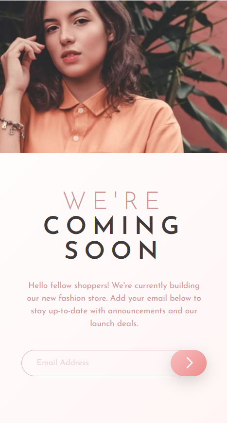
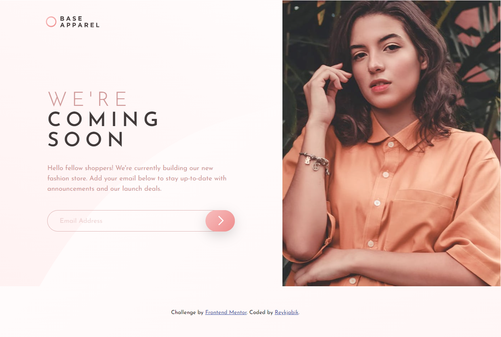
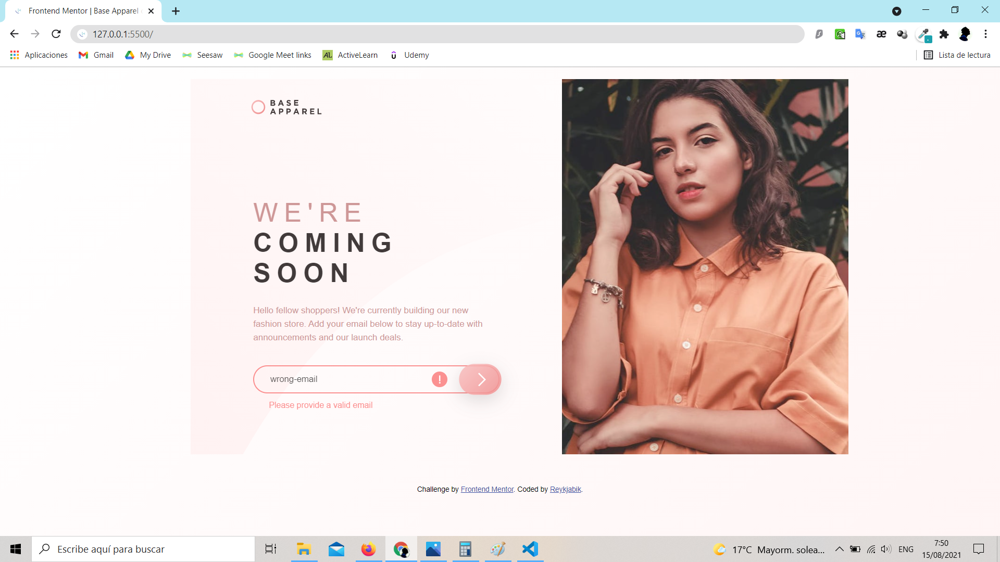

# Frontend Mentor - Base Apparel coming soon page solution

This is a solution to the [Base Apparel coming soon page challenge on Frontend Mentor](https://www.frontendmentor.io/challenges/base-apparel-coming-soon-page-5d46b47f8db8a7063f9331a0). Frontend Mentor challenges help you improve your coding skills by building realistic projects. 

## Table of contents

- [Overview](#overview)
  - [The challenge](#the-challenge)
  - [Screenshot](#screenshot)
  - [Links](#links)
- [My process](#my-process)
  - [Built with](#built-with)
  - [What I learned](#what-i-learned)
  - [Continued development](#continued-development)
  - [Useful resources](#useful-resources)
- [Author](#author)

## Overview

### The challenge

Users should be able to:

- View the optimal layout for the site depending on their device's screen size
- See hover states for all interactive elements on the page
- Receive an error message when the `form` is submitted if:
  - The `input` field is empty
  - The email address is not formatted correctly

### Screenshot





### Links

- Solution URL: [Frontend Mentor](https://www.frontendmentor.io/challenges/base-apparel-coming-soon-page-5d46b47f8db8a7063f9331a0/hub/base-apparel-with-html-css-and-js-NW3-DJTSt)
- Live Site URL: [Github Page](https://reykjabik.github.io/base-apparel-coming-soon/)

## My process

### Built with

- Semantic HTML5 markup
- CSS custom properties
- Flexbox
- CSS Grid
- Mobile-first workflow

### What I learned

One of the features that I learned and liked the most was the `picture` tag.

```html
<picture class="hero">
      <source media="(max-width: 799px)" srcset="./images/hero-mobile.jpg">
      <source media="(min-width: 800px)" srcset="./images/hero-desktop.jpg">
      
    </picture>
```

This allows your browser to choose among different image sources depending on the device you are using, straight in HTML.

### Continued development

I still need to work more on form elements. I am not even sure I used the `label` tag correctly on this exercise, but other solutions I was trying wouldn't show me the expected result. 

Watching a few tutorials about how to solve some things I came across, I found many people work on SCSS/SASS. While I know it's not a must, I likes some of the features, so I am thinking to start applying it to future projects.

### Useful resources

- [Stack Overflow](https://stackoverflow.com/) - No need to introduce it.
- [CSS Tricks - Grid](https://css-tricks.com/snippets/css/complete-guide-grid/) - There is always something I forget about implementing the Grid, so this is my go to guide.

## Author

- Frontend Mentor - [@reykjabik](https://www.frontendmentor.io/profile/Reykjabik)
